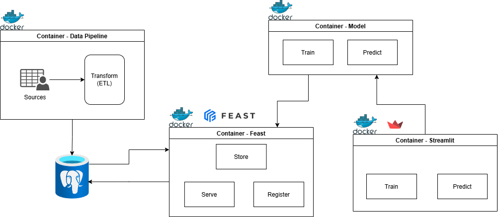

# fiap-datathon

## Objetivo

Este projeto visa implementar um projeto de MLOps para prever os próximos cliques de notícias de um usuário.

## O que foi utilizado

Neste projeto foram utilizados técnicas de tratamento de dados e ETL para ingestão no banco em PostGreSQL.

O pipeline de dados, modelo, feature store e streamlit foram inseridos em containers. A orquestração dos containers foi construída usando o docker-compose.yml respeitando as portas de cada serviço.
Para a feature store foi utilizado o Feast.
Interface para simulação de usuário e controle da materialização da feature store foi feita utilizando o streamlit.

Toda conexão entre os containers foi realizada através de Web API com o FastAPI no Python.

## Desenho de solução

